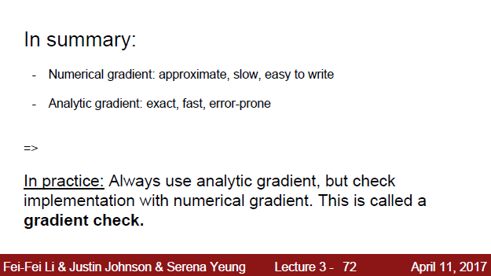

# Lecture 3_ Loss Functions and optimization

## 1. Loss Function

### 1.1 Principle

设置损失函数的目的是通过该函数值的大小来反应训练过程中分类器的拟合程度，我们要做的就是让损失函数值下降到一定程度。

所以每一轮训练结束后，我们都会获得一个损失值（Loss），整个数据集的Loss等于每条数据的Loss之和，经历过多轮训练后，当Loss变化很小时，可以认为训练结束了，可以停止训练了，因为再怎么训练也不会有很大的提高了。

### 1.2 Multiclass SVM loss

这里以多类别SVM的损失函数为例，损失函数有很多种，这里采用Hinge loss，其中1是margin，即我们总是期望在分类器的输出值矩阵中，正确类别对应的输出值远远高于其他错误类别的输出值（比如像下图中的汽车图片，下方对应的输出中car对应的值为4.9，高于cat和frog对应的值，我们就可以将这张图片归于汽车这一类别）。所以这里的margin指的是当正确类别对应的输出值比其他错误类别对应的输出值 大于1时（$s_{yi} \geq s_j +1$），对应的loss为0，当$s_{yi}​$取其他值时对应的loss都要大于0。

这样设置损失函数，会导致一个严重的问题：W不唯一，简单地说，就是同样的Loss可能对应几个W取值，那到底选哪个比较好呢？

### 1.3 Regularization

解决方法是在损失函数中增加正则化项

这里讲了几种正则化函数

L1和L2正则化不一样，如下图所示，L2正则化倾向于选择$\omega_2​$  

确实L2正则化的结果很像贝叶斯理论中的最大似然估计，最终的优化结果都是希望所有的权重能够平均分布

### 1.3 Softmax Classifier(Multinomial Logistic Regression)

Softmax function:  $\frac{e^s y_i}{\sum_j e^{s_j}}​$ 取值范围为0到1

loss function: $L_i = -log(\frac{e^s y_i}{\sum_j e^{s_j}})$ 当Softmax function取值为1时，loss为0；而当Softmax function取值趋向于0时，loss趋向于正无穷。

举个例子来讲softmax classifier的计算过程：

Softmax使用的就是交叉熵损失（cross-entropy loss）

softmax 和SVM对比分析，SVM采用的是hinge loss，根据之前所讲的设定值，只要boundary margin超过1，loss就为0了，也没有必要再优化了。而Softmax不一样，softmax会无限优化权重值。

Softmax和SVM总结：

##  Optimization

上面讲了如何设置损失函数，那接下来我们肯定想知道怎么能够快速地使损失函数收敛，这就是下面要讲的优化方法。

### 2.1 Gradient descent

step size 也被称为learning rate ，即学习速率。知识点：Justin Johnson说这个超参数往往是他第一个调的参数，先把这个参数调好，然后再调model size、regularization length等超参数。

Numerical gradient是指 $\frac{df(x)}{dx}=\lim\limits_{h \to 0} \frac{f(x+h)-f(x)}{h}$ ，在计算每个权重对应的梯度时，都是使用以下方法：保持其他权重值不变，改变某个权重值，看最终loss的变化，然后使用上述公式计算。

但是这是一个比较笨的方法，会增加很多计算量，如果使用牛顿-莱布尼茨公式，我们可以得到梯度的表达式，即analytic gradient，这样直接代数值进去计算，这样会快很多。所以实际应用中，都是使用analytic gradient。

另一个实际应用中会遇到的问题是，如果每次迭代都是用全部样本来更新gradient，因为实际问题的样本量N很大（甚至达到百万级别），会耗费很多时间来计算。因此，人们就想出了minibatch（通常包含32/64/128个样本），将所有的example分成很多个minibatch，这样每次迭代都是使用一个minibatch来更新gradient，这样会快很多。

### 2.2 Image features

在图像分类任务上面，我们往往不是直接将raw picture的像素值直接作为训练Classifier的输入量，而是会通过features transform，从raw picture中提取出一些特征（features extraction），再将这些features作为training set，训练分类器。

常用的特征提取方法有：Color Histogram， Histogram of Oriented Gradients(HoG), Bag of Words

上面讲的Image classification pipeline 是比较传统的方法，在通过feature extractor提取到特征之后，这些特征在训练过程中是不会改变的，改变的只是classifier中的权重。但是在卷积神经网络方法中，不是这么干的，它在网络中有特征提取层，就是说特征在训练过程中是会改变的。

