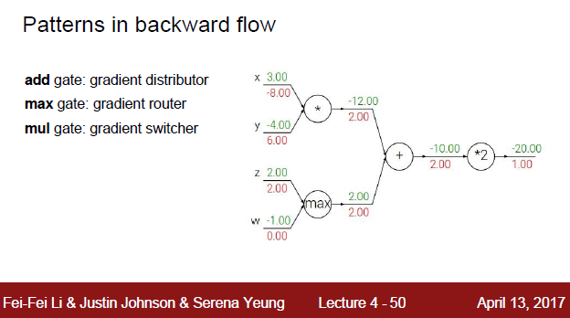
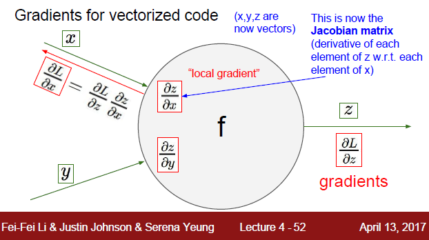

# Lecture4 _Backpropagation and Neural Networks

## 1 Backpropagation

### 1.1 Introduction

lecture3 讲了怎么求loss，怎么optimization，而optimization的过程中就包含了不断的forward propagation and backpropagation。反向传播的过程中就是根据前向传播得到的结果Loss，反过来更新权重W的过程。这一讲就是详细地描述整个backpropagation的过程，并举了一系列例子来帮助大家理解这个过程。

这里讲了computational graphs这个概念，可能用计算流图来表示比较简洁明了吧。

Chain rule: $\frac{\partial f }{\partial q}=\frac{\partial f}{\partial q} \frac{\partial f}{\partial x}$  这里只是举了个两次递归的例子，如果式子很复杂也一样，一层一层往上递归就是了。有同学有疑问说，为什么要这么做，为什么不直接对整个式子求微分。这是因为下面这个例子是比较简单的情况，如果遇到复杂一点的式子（有根号，指数，乘法等等），我们很难直接对整个式子求微分的话，如果把它拆开成多个式子的组合，递归求解就会简化很多。

sigmoid function : $\sigma (x) = \frac{1}{1+e^{-x}}$ 

这个函数在机器学习中还是挺常见的，函数图像呈S型，值域为$(0,-1)$ 

这里讲了不同的运算对应的梯度变化，加法不会改变梯度值，而是将梯度值分配给两部分；max运算、乘法运算也有其梯度含义。

### 1.2 From scalar to vector

上面讲的都是标量运算，而在实际应用中更多的是向量或者矩阵的运算，所以我们需要看看梯度在向量中是怎么计算的。

下图中， $x\in \mathbb R^n \quad W \in \mathbb R^{n\times n}​$  

Modularized implementation

Summary

## 2. Neural Networks

### 2.1 Introduction

简单的两层神经网络：

神经网络和大脑类比分析：

这里讲的Neural networks（神经网络）和人类大脑中的神经网络机制还是有很大的不同的，简单地说，就是大脑更加复杂。

列举了几种activation functions:

老师把这个激活函数讲的很模糊，查了一下资料，简单地说，引入激活函数就是引入了非线性模型，提高了模型的拟合能力。（网络的每一层在输出时，都需要进行一次**非线性变换**，被称为**激活**。）

Summary:

下节课开始讲卷积神经网络