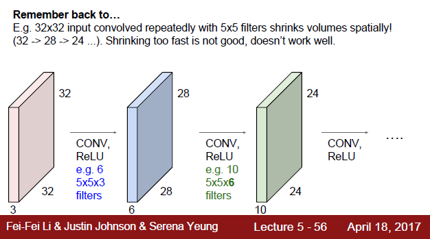

# Lecture5: Convolutional Neural Networks

## 1. Introduction

### 1.1

之前的lecture讲的linear classifier采用的就是全连接层结构，把一张32x32x3的图片伸展成3072x1的向量，再用权重矩阵W (10x3072 )，即W中每一列代表一种图片类别对应的权重模板，$Wx​$ 得到一个score 矩阵（10x1)，最终根据score矩阵中的最大值来判断该图片属于哪一个类别。

全连接层的缺点很明显，破坏了图片的空间结构，图片是有前后左右位置关系的，如果将图片拉成一个向量，就会破坏这种空间位置关系。

那么，为了提取图片特征的同时，又能保留图片的空间结构，就有人提出了卷积层这种结构。简单地说，建立一个卷积核，然后用这个filter移动扫描整张图片，每次产生的结果就是卷积核和图片对应位置的点积结果。

### 1.2

卷积神经网络就是由一系列的卷积层组成的，提取的特征也从low-level到high-level

以下图为例，该图片NxN，卷积核FxF，移动步长stride,假设output size为x

则$x=\frac{N-F}{stride}+1$  

在实际应用中，如果对一张图片一直做卷积，output size就会越来越小，导致图片空间体积缩小。

所以，人们就想到了，在做卷积之前，扩大图片的size，一种常见方法是zero padding，即在图片矩阵四周再加上一圈zero。

这里举个例子：

每层参数个数的计算，不要忘了还有一个bias参数。

**Summary：**

## 2 CONV Layer

 ### 2.1 The brain/neuron view of CONV Layer

 ###  

### 2.2 Pooling layer

池化层：下采样

那池化层有啥作用呢？为什么之前的zero padding要保留图像矩阵的大小，现在反而要减小矩阵大小了呢？

1. 不变性，增加了平移不变性、旋转不变性和尺度不变性。这样的话，就算以后在test中遇到平移、旋转和尺度变化后的图片，也能准确判断，提高了特征容忍性。
2. 降维，减少了参数，即减小了计算量、减小了内存消耗
3. 提高感受野大小 https://www.jianshu.com/p/9997c6f5c01e
4. 防止过拟合

reference: https://www.zhihu.com/question/36686900

池化层的函数有很多种，最大池化：

**处理流程：**

举个图像分类问题的神经网络架构

## 3. Summary

