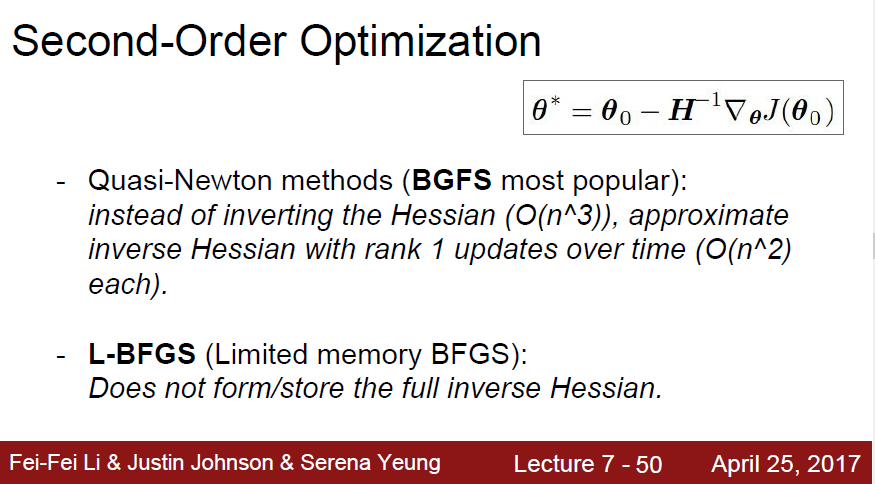
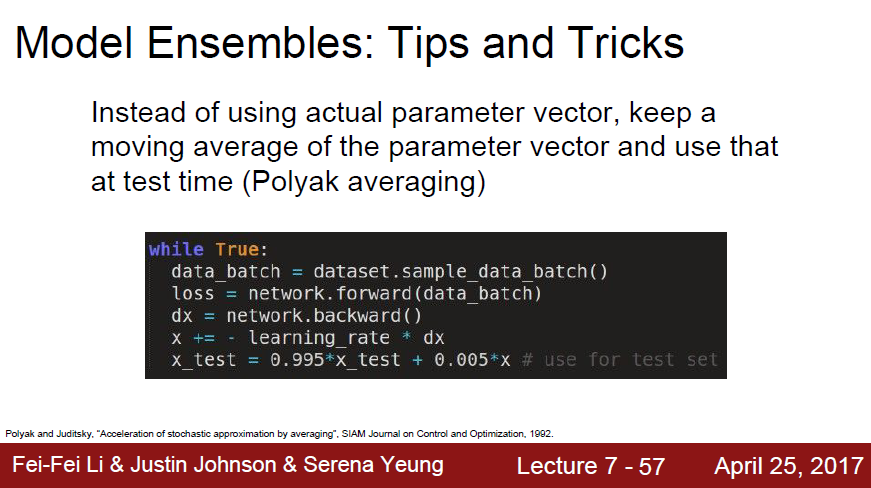
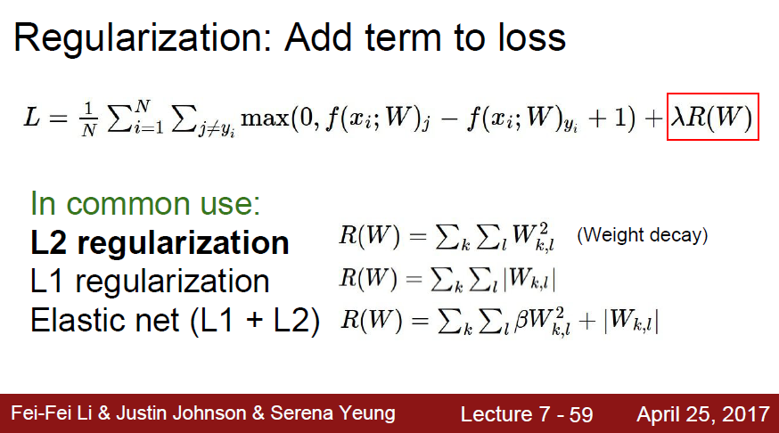
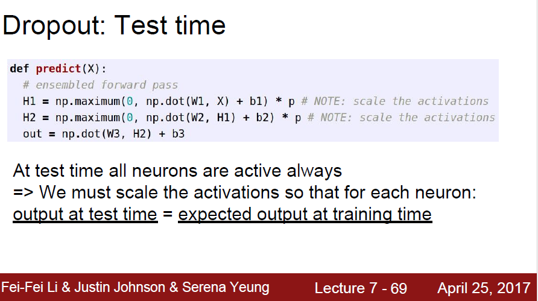
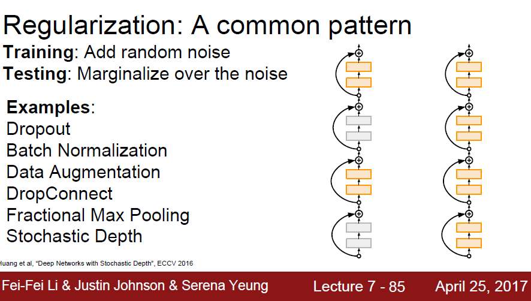
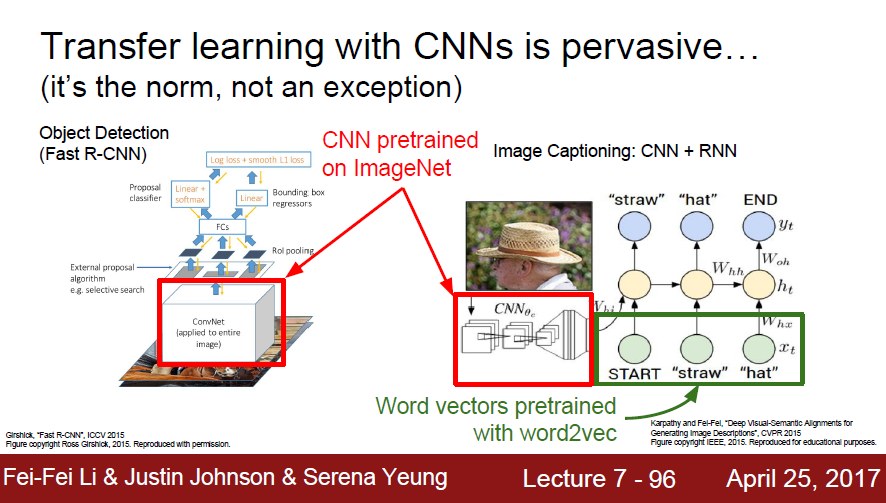

# Lecture 7 : Training Neural Networks Part 2

## 1. Optimization

这里主要讲了各种优化器的处理算法

### 1.1 SGD

首先喷了一下SGD的缺点：一共有三条

第一条是SGD（随机梯度下降）太慢了

第二条是在遇到局部极小点的时候，还有鞍点的时候，这时候梯度为0，就没办法继续优化下去了。

在高维问题上，鞍点是很常见的，在某些方向上梯度增加，而在某些方向上梯度减小。

第三条是我们是把整个训练集分成很多小的minibatch送进去优化器的，这就导致了minibatch中有很多的噪声，会导致优化路径的震荡

### 1.2 SGD+Momentum

在SGD的基础上加了动量Momentum，有了Momentum后，即使碰到鞍点，它也能往前冲，继续优化，不会停滞不前。

**SGD+Momentum**
$$
v_{t+1} = pv_t + \nabla f(x_t)  \\
x_{t+1} = x_t - \alpha v_{t+1}
$$

对下图中PPT进行修正： x += -learning_rate*dx (漏了个负号)

### 1.3 Nesterov Momentum

vanilla momentum，即最原始的没有经过修饰改进的momentum，是在一个点同时求出velocity和gradient，然后更新参数

而经过优化后的Nesterov Momentum是在一个点先计算出velocity，然后更新，在更新后的点处再计算出gradient再进行参数更新

### 1.4 AdaGrad

adaGrad换了一种思路，原本的sgd只是x -= learning_rate * dx

然后这里加了一个分母，梯度dx越大的方向上，除以np.sqrt(grad-squared)后，值就变小了，这样的x的更新就不会一下跳跃太大

对于梯度dx越小的方向上，除以np.sqrt(grad-squared)后，值反而变大了（比如dx<1的情况就很明显），这样x的更新就会快一点。

1e-7是为了防止分母为0而出现错误

这样就克服了sgd在陡峭方向抖动很大而在平缓方向上更新缓慢的缺点。

### 1.5 RMSProp

RMSProp是在AdaGrad的基础上做的进一步优化，grad_squared作了改进，增加了衰减率decay_rate 

可以发现，相比于SGD+Momentum，RMSProp没有overshoot，就是说没有先越过了极小值点再返回来

### 1.6 Adam

adam优化器则是综合了momentum和adagrad/RMSprop的思想

### 1.7 tricks

对学习率作衰减操作

对学习率作衰减操作

### 1.8 L-BFGS

==需要补充 ----L-BFGS== 

### 1.9 Summary

在实际操作中，adam适用性比较强，如果可以适用全批量进行更新的话可以尝试L-BFGS

### 2. Model Ensembles

使用多模型来对同一个输入进行预测，然后对多个输出取平均来作为最终输出，可以提高模型性能

一些技巧：使用model ensembles ，并不一定要从头开始训练多个模型，那样会耗费大量的时间，我们可以在模型训练过程中随机保存下来一些临时模型，作为多模型的组合。

## 3. Regularization

终究到底，我们使用上面的model ensembles就是为了提高整个系统的预测能力，也就是泛化能力generalization， ensemble的思想就是一个模型预测能力不行，那我就用多个模型来预测呗，然后再取平均。这是“三个臭皮匠”的思想。

那另一种思想就是，怎么来提高单模型的泛化能力？这就是regularization

### 3.1 Add term to loss

这是经常使用的一种正则化方法，就是在损失函数里头再加个正则项，常见的有L1/L2正则化。简单的来说，正则项加在损失函数里，我们的优化器目标又是最小化损失函数，这就会使得每一个权重参数值不会太大，不会出现某一个权重参数远远大于其他权重的情况，也就是说每一个权重参数都会对模型的预测有一点贡献，即增加了泛化能力。

### 3.2 Dropout

Dropout的操作分成两部分，第一部分是在train time，第二部分是在test time

在trian time中，就是随机地扔掉一些节点，即将一些神经元（权重）置为零

Dropout为什么会有好的正则化效果？

在测试中，需要乘以dropout probability

实际写代码的时候，‘Inverted dropout’ 一般还是在trian step中除以dropout  probability，然后在test time中不进行任何操作。

### 3.3 A common pattern

Batch Normalization, BN层加在全连接层和激活函数之间

### 3.4 Data Augmentation

数据增强，比如对图片进行水平翻转，对图片进行裁剪缩放（ResNet）,色彩抖动等等

### 3.5 Summary

regularization的方法其实还是多种多样的

## 4. Transfer Learning

迁移学习不需要很多的数据就可以训练出一个好模型

==迁移学习的原理待补充==

CNN预训练模型

## 5. Summary

