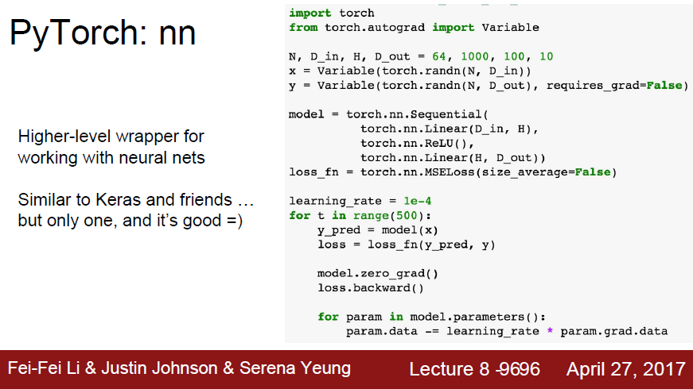
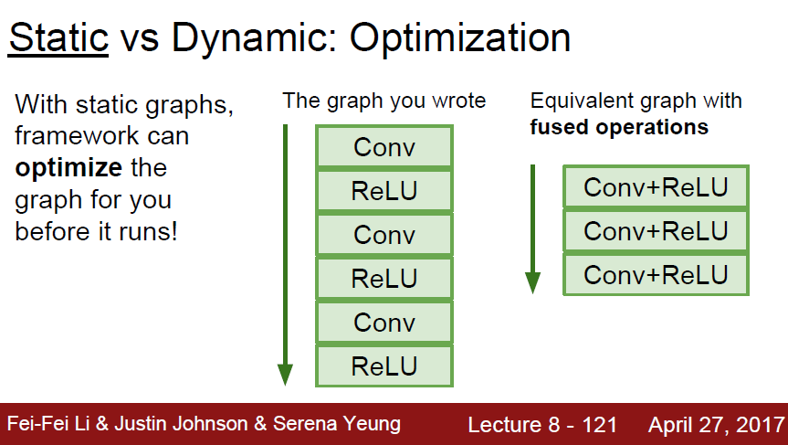

# cs231n_lecture8_Deep Learning Software

这节主要讲了CPU和GPU的对比，为什么深度学习更倾向于使用GPU

然后对比分析了深度学习的一些框架，TensorFlow，PyTorch, Caffe

## 1. CPU vs GPU 

### 1.1 CPU和GPU的优缺点

这里对CPU和GPU的优缺点进行了对比分析，虽然CPU的单核性能更好一点，但是GPU的核心更多，更擅长并行计算。比如在矩阵的乘法运算中，行乘以列，GPU几千个核心可以并行地把这些行乘以列的结果很快算出来。

### 1.2 CUDA，CUDNN

平常我们运行python代码都是CPU运算的，突然要使用GPU来运算，还真会让人糊涂。可是，NVIDIA早就已经封装好了一些高级库，我们直接调用就可以使用GPU来计算了。比如，已经很成熟的CUDA，在CUDA的基础行做进一步优化的封装库cuDNN。

下面两张图对比了CPU和GPU运行CNN的速度，GPU很显然要快很多，并且使用cuDNN还要提高3倍左右的速度。

### 1.3 CPU/GPU Communication

虽说我们使用了GPU来训练模型，但是读数据还是得靠CPU来读的。因此GPU和CPU之间的通信也是一个要特别注意的问题，比如我们可以先把所有数据读进RAM，可以使用读写更快的固态。

## 2. Deep Learning Frameworks

深度学习框架更新很快，这是2017年4月总结的 PPT，两年过去了，沧海桑田啊。

### 2.1 Introduction

### 2.2 TensorFlow

#### 2.2.1 Neural Net

tensorflow是先建好一个graph,然后进行运算

building graph不会进行任何计算

下图中代码的问题是权重值在CPU和GPU间来回传递会耗费时间

进一步优化：w1,w2由placehold(fed on each call)换成variable(persists in the graph);  增加assign操作来更新w1,w2，相当于把更新权重作为图的一部分（原来是GPU计算出grad,然后交给CPU去更新权重，更新完再传回给GPU计算，这样太慢了）

然后又遇到了问题，loss没有降下来，说明权重压根就没有更新

debug: 添加依赖于更新的虚拟图节点，并告诉graph计算该虚拟节点，这样graph每次迭代都会更新权重

#### 2.2.2 Optimizer, Loss, Layers

进一步优化：

- 使用已有的优化器函数

- 使用已有的损失函数

- tensorflow连层都已经封装好了，relu都不用自己写了，直接调用就activation=tf.nn.relu就行，然后设置一些参数就好了

#### 2.2.3 Keras

Keras是在TensorFlow的基础做更高一级封装的框架，它让一切变得更加简单

其他的一些在TensorFlow基础上的高级封装库

#### 2.2.4 Pretrained Models/ Tesorboard

Pretrained Models 预训练模型

Tensorboard 对训练过程进行可视化分析

#### 2.2.5 Theano

Tensorflow 由 Theano进化而来

### 2.3 PyTorch

PyTorch 的 Tensor, Variable, Module

#### 2.3.1 Tensors

PyTorch中的Tensors不同于TensorFlow中的Tensor, 它相当于numpy中的np.array。可以把它看做是一个普通的矩阵。

# 

想在GPU中运算的话也只需把tensors定义成cuda dtype就行了，还挺方便

#### 2.3.2 Autograd

一个pytorch变量是图中的一个节点, 假设Variable x， 则x.data 是一个tensor，x.grad 是一个Variable

不需要grad的Variable就把requires_grad置为False就好啦

#### 2.3.3 New Autograd Functions

我们可以定义自己的自动更新梯度函数

#### 2.3.4 PyTorch：nn

nn可以直接定义我们的model (sequence of layers), 并定义loss函数

#### Pytorch: optim

#### 2.3.5 Define new Modules

我们可以使用nn高级封装库来搭建自己的Modules

#### 2.3.6 DataLoaders

#### 2.3.7 Pretrained Models

#### 2.3.8 Visdom

可视化工具，类似于TensorFlow的tensorboard

#### 2.3.9 Torch

Torch和Pytorch的对比

现在Pytorch发展的也挺好了，基本上都使用pytorch了

### 2.4 TensorFlow 和 PyTorch 对比

TensorFLow建图好了就不会再变动了，运行多次进行迭代；而PyTorch是每一次前馈传播都建一个新图。一个静态，一个动态

在TensorFlow中，也开发了==TensorFlow Fold==通过动态batching 来实现动态图

这里举了一些需要Dynamic Graph的应用例子

### 2.5 Caffe

贾扬清在UC Berkeley开发的框架 Caffe

caffe的基本步骤如上图所示，具体请看lecture8的PPT吧，这里不仔细写。因为这些框架发展的蛮快了，这是2017年4月的caffe，现在也不知道是不是更甜了还是变苦了。

#### Caffe框架的优缺点

### 2.6 Caffe 2

Caffe 2 是贾扬清从UC Berkly毕业后，到Facebook弄出来的框架

（一周前开发出来的框架，Justin在课上就做PPT来讲了，真是感叹人家对上课是多么的认真啊，想想之前有些老师的PPT还是五六年前，唉）

### 2.7 Summary

## 3. Summary

总的来说，TensorFlow的社区很强大，keras封装起来还是很好用的

而对于研究来说，Justin觉得PyTorch是一个很好的选择

